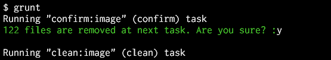
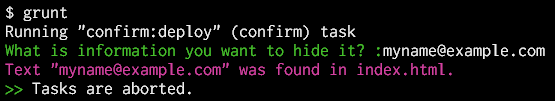

# grunt-confirm

Abort or continue the flow of tasks according to an answer (with or without Enter key) to the specified question. The flow of tasks is paused, until the user responds and the next behavior is found by specified options.





## Getting Started

This plugin requires Grunt `~0.4.1`

If you haven't used [Grunt](http://gruntjs.com/) before, be sure to check out the [Getting Started](http://gruntjs.com/getting-started) guide, as it explains how to create a [Gruntfile](http://gruntjs.com/sample-gruntfile) as well as install and use Grunt plugins. Once you're familiar with that process, you may install this plugin with this command:

```shell
npm install grunt-confirm --save-dev
```

Once the plugin has been installed, it may be enabled inside your Gruntfile with this line of JavaScript:

```js
grunt.loadNpmTasks('grunt-confirm');
```

## The "confirm" task

In your project's Gruntfile, add a section named `confirm` to the data object passed into `grunt.initConfig()` (see [Configuring tasks](http://gruntjs.com/configuring-tasks)).

### Options

#### `question`

*Type:* string, function or `undefined`

Display a specified string or a returned string by a specified function to the user.  
If the function returns a *falsy*, this task is finished immediately. And the flow of tasks is continued.

The function is passed a `files` argument. That is the standard Grunt `files` components (see [Files](http://gruntjs.com/configuring-tasks#files)).  
The function can make the question text by using it.

If this option is not specified when `'_key'` is specified to the [`input`](#input) option and the [`proceed`](#proceed) option is not specified (i.e. you want to let the flow of tasks just pause), a message `'Continue... (Hit any key)'` is displayed.

For example:

`Gruntfile.js`

```js
grunt.initConfig({
  confirm: {
    build: {
      options: {
        // Static text.
        question: 'This processing requires about 10 minutes. Continue?',
        input: '_key:y'
      }
    }
  },
  // Other tasks...
});
```

```js
grunt.initConfig({
  confirm: {
    deploy: {
      src: '<%= copy.deploy.src %>', // refer to another task
      options: {
        question: function(files) {
          var count = 0;
          files.forEach(function(f) { count += f.src.length; });
          return !count ? false : // No file. And do nothing.
            count + ' files are copied at next task. Are you sure?';
        },
        input: '_key:y'
      }
    }
  },
  copy: {
    deploy: {
      expand: true,
      cwd: 'src/',
      src: '**/*.html',
      dest: 'public_html/'
    }
  }
});
```

#### `input`

*Type:* string or `undefined`

Accept the user's input that is specified type.

* If it is not specified (i.e. `undefined`), accept a **text** (with an Enter key), and let the [`proceed`](#proceed) option decide whether to continue the flow of tasks.
* If a comma-separated string like `'text1,text2'` is specified, accept a **text** (with an Enter key), and continue the flow of tasks when the input text was found in that comma-separated string, otherwise abort it.
* If `'_key'` is specified, get a pressed **key** (without an Enter key), and let the [`proceed`](#proceed) option decide whether to continue the flow of tasks.
* If a string `'_key:charlist'` is specified, get a pressed **key** (without an Enter key), and continue the flow of tasks when the pressed key was found in that `charlist`, otherwise abort it. The `charlist` is a string that includes characters as the keys. For example, if `'_key:abc'` is specified, continue the flow of tasks when the `A`, `B` or `C` key is pressed.

The string comparisons are case-insensitive (i.e. `a` equals `A`).

#### `proceed`

*Type:* function, boolean or `undefined`

Decide whether to continue the flow of tasks when the [`input`](#input) option is not specified (i.e. `undefined`) or `'_key'` is specified to it.

If a function is specified, call the function, and continue the flow of tasks when that returns a *truthy*, otherwise abort it.  
The function is passed an `answer` and a `files` arguments. The `answer` is a string that was input by the user, or a single character as a pressed key by the user. The `files` is the standard Grunt `files` components (see [Files](http://gruntjs.com/configuring-tasks#files)).  
The function can determine to abort or continue by using those.

If `false` is specified, the flow of tasks is aborted immediately. And the remaining tasks will not run.  
Otherwise the flow of tasks is continued. That is, when any text was input or any key was pressed, it is continued. It is just paused until it.

For example:

`Gruntfile.js`

```js
grunt.initConfig({
  confirm: {
    pack: {
      src: '<%= another.pack.src %>', // refer to another task
      options: {
        question: 'How many files are required?',
        proceed: function(answer, files) {
          var count = 0;
          files.forEach(function(f) { count += f.src.length; });
          if (count < +answer) {
            grunt.log.writeln('There are only ' + count + ' files.');
            return false;
          } else {
            return true;
          }
        }
      }
    }
  },
  // Other tasks...
});
```

```js
grunt.initConfig({
  confirm: {
    build: {
      options: {
        question: 'Do you want to build? :',
        input: '_key:y' // Continue the flow if `Y` key is pressed.
      }
    }
  },
  // Other tasks...
});
```

```js
grunt.initConfig({
  confirm: {
    // Show something. Pause until any key is pressed.
    showMessage: {options: {input: '_key'}}
  },
  // Other tasks...
});
```

## See Also

If you want to more process, consider [grunt-task-helper](https://github.com/anseki/grunt-task-helper) and [readlineSync](https://github.com/anseki/readline-sync).
